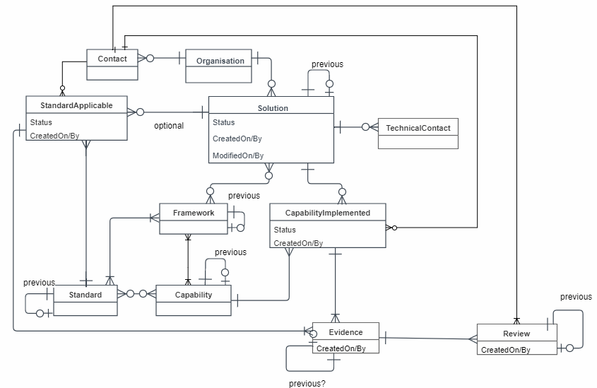
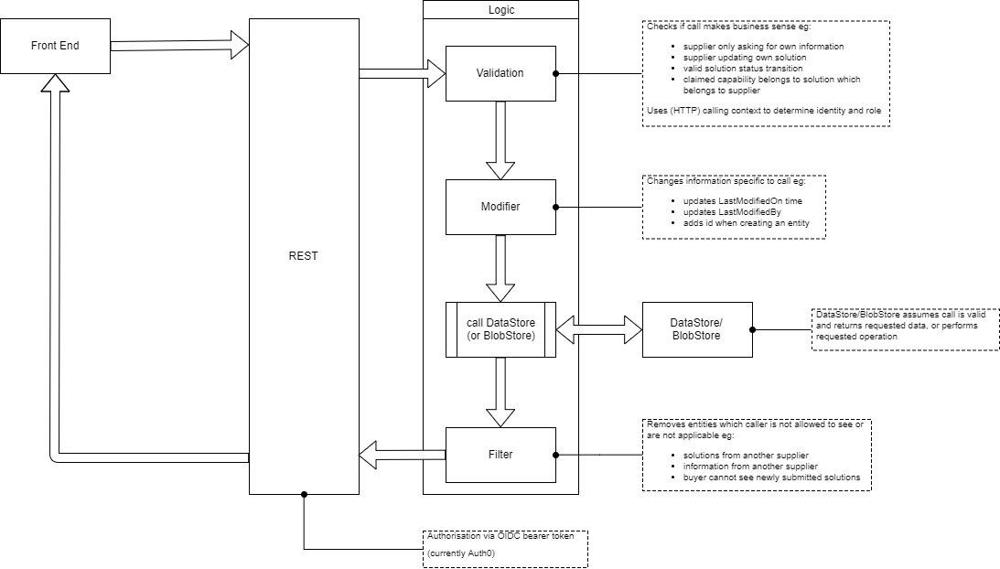

# NHS Buying Catalog Private Beta 

This was a project done for NHS Digital in the United Kingdom. The initial work was a website where suppliers of software to the NHS
could:
* register a product/s with an NHS _framework_
* select which _capabilities_ the product provides
* select which _standards_ the product meets
* submit _evidence_ to support its claimed _capabilities_
* submit _evidence_ to support its claimed _standards_
* have the _evidence_ reviewed against its claimed _capabilities_
* have the _evidence_ reviewed against its claimed _standards_
* engage in dialogue with an NHSD _capabilities_ review team
* engage in dialogue with an NHSD _standards_ compliance team
* create an information page about the product
* be approved for sale

The overall architecture is a classic 3-tier application ie:
* presentation
  * web app in NodeJS
* business logic
  * C# .NET core
* data storage
  * relational database eg Microsoft SQL Server
  * Microsoft Dynamics CRM
  * Microsoft SharePoint

<details>
<summary>System Overview</summary>


</details>

<p>

<details>
<summary>Data Model</summary>



</details>

## NHSD.GPITF.BuyingCatalog API
* RESTful APIs for data
* Swagger UI for testing
* pluggable datastores for supplier data (SQL database or MS Dynamics CRM)
* pluggable blobstore for supplier evidence aka binary data (MS SharePoint or MongoDB)
* pluggable OAuth provider (currently Auth0)

* Swagger UI : https://localhost:5000/swagger/index.html

<details>
<summary>Low Level Design</summary>



</details>

## Prerequisites
* .NET Core 2.1
* Optional:
  * Docker
  * Microsoft SQL Server

## Getting Started

```bash
  git clone https://github.com/TrevorDArcyEvans/NHSBuyingCatalogue.git
  cd NHSBuyingCatalogue/beta-private/api/NHSD.GPITF.BuyingCatalog
  dotnet build
  dotnet test
```

## Settings
* Various settings are output to the console log on startup
 * Settings are obtained from:
   * appsettings.json
   * hosting.json
   * autofac.json
   * nLog.config
   * _user secrets file_
   * environment variables

<details>

 | Setting                                          | Environment Variable                      | Description
 |:-------------------------------------------------|:------------------------------------------|:--------------------------------------
 | urls                                             |                                           | URL to host Swagger UI for testing
 | <hr>                                             | <hr>                                      | <hr> 
 | RepositoryDatabase:Connection                    | DATASTORE_CONNECTION                      | Which database connection to use eg _SqLite_
 | RepositoryDatabase:SqLite:Type                   | DATASTORE_CONNECTIONTYPE                  | Type of database to which we are connecting eg _PostgreSql_ <p>Valid values:<ul><li>SqlServer</li><li>SqLite</li><li>MySql</li><li>PostgreSql</li></ul>
 | RepositoryDatabase:SqLite:ConnectionString       | DATASTORE_CONNECTIONSTRING                | .NET connection string to database to store results <p> eg:  ```Data Source=|DataDirectory|Data/BuyingCatalog.sqlite3;```
 | <hr>                                             | <hr>                                      | <hr> 
 | UseCRM                                           | USE_CRM                                   | whether to use _Microsoft Dynamics CRM_ as a datastore eg false
 | CRM:ClientId                                     | CRM_CLIENTID                              | 
 | CRM:ClientSecret                                 | CRM_CLIENTSECRET                          | 
 | CRM:CacheExpiryMins                              | CRM_CACHE_EXPIRY_MINS                     | 
 | CRM:ShortTermCacheExpirySecs                     | CRM_SHORT_TERM_CACHE_EXPIRY_SECS          | 
 | CrmUrl                                           | GIF_CRM_URL                               | 
 | CrmAuthority                                     | GIF_CRM_AUTHORITY                         | 
 | GIF:Authority_Uri                                | GIF_AUTHORITY_URI                         | default: _http://localhost:5001_
 | AzureClientId                                    | GIF_AZURE_CLIENT_ID                       | 
 | EncryptedClientSecret                            | GIF_ENCRYPTED_CLIENT_SECRET               | 
 | <hr>                                             | <hr>                                      | <hr> 
 | Jwt:Authority                                    | OIDC_ISSUER_URL                           | 
 | Jwt:Audience                                     | OIDC_AUDIENCE                             | 
 | Jwt:UserInfo                                     | OIDC_USERINFO_URL                         | 
 | <hr>                                             | <hr>                                      | <hr> 
 | SharePoint:BaseUrl                               | SHAREPOINT_BASEURL                        | 
 | SharePoint:OrganisationsRelativeUrl              | SHAREPOINT_ORGANISATIONSRELATIVEURL       | 
 | SharePoint:ClientId                              | SHAREPOINT_CLIENT_ID                      | 
 | SharePoint:ClientSecret                          | SHAREPOINT_CLIENT_SECRET                  | 
 | SHAREPOINT_PROVIDER_ENV                          | SHAREPOINT_PROVIDER_ENV                   | set to _test_ to use fake SharePoint server
 | SharePoint:FileDownloadServerUrl                 | SHAREPOINT_FILE_DOWNLOAD_SERVER_URL       | default: _http://localhost:9000/_
 | <hr>                                             | <hr>                                      | <hr> 
 | AMQP:UseAMQP                                     | USE_AMQP                                  | default: _false_
 | AMQP:UseAzureServiceBus                          | USE_AZURE_SERVICE_BUS                     | default: _false_
 | AMQP:Protocol                                    | AMQP_PROTOCOL                             | default: _amqp_
 | AMQP:PolicyName                                  | AMQP_POLICY_NAME                          | default: _admin_
 | AMQP:PolicyKey                                   | AMQP_POLICY_KEY                           | default: _admin_
 | AMQP:NamespaceUrl                                | AMQP_NAMESPACE_URL                        | default: _localhost:5672_
 | AMQP:TopicPrefix                                 | AMQP_TOPIC_PREFIX                         | default: _topic://_
 | AMQP:TtlMins                                     | AMQP_TTL_MINS                             | default: _7*24*60_ ie 7 days
 | <hr>                                             | <hr>                                      | <hr> 
 | Log:ConnectionString                             | LOG_CONNECTIONSTRING                      | .NET connection string to a database to send logs 
 | Log:CRM                                          | LOG_CRM                                   | whether or not to log communications with _Microsoft Dynamics CRM_ eg false
 | Log:SharePoint                                   | LOG_SHAREPOINT                            | whether or not to log communications with _Microsoft SharePoint_ eg false
 | Log:BearerAuth                                   | LOG_BEARERAUTH                            | whether or not to log communications with _OAuth_ provider eg false
 | <hr>                                             | <hr>                                      | <hr> 
 | Cache:Host                                       | CACHE_HOST                                | .NET connection string to _Redis_ instance
 

 ```json
{
  "urls": "http://*:5100",

  "wwwroot": "wwwroot",

  "UseCRM": false,

  "GIF":
  {
    "Authority_Uri": "http://crm:5001"
  },

  "Log":
  {
    "ConnectionString": "Data Source=|DataDirectory|Data/NHSD.GPITF.BuyingCatalog.sqlite3;",
    "CRM": true,
    "SharePoint": true,
    "BearerAuth": true
  },

  "Cache":
  {
    "Host": "localhost"
  },

  "RepositoryDatabase":
  {
    "Connection": "SqLite",

    "SqLite":
    {
      "Type": "SqLite",
      "ConnectionString": "Data Source=|DataDirectory|Data/NHSD.GPITF.BuyingCatalog.sqlite3;"
    },

    "SqlServer":
    {
      "Type": "SqlServer",
      "ConnectionString": "Data Source=localhost;Initial Catalog=BuyingCatalog;Integrated Security=True;MultipleActiveResultSets=True"
    },

    "MySql":
    {
      "Type": "MySql",
      "ConnectionString": "server=127.0.0.1;uid=NHSD;pwd=DisruptTheMarket;database=BuyingCatalog;SslMode=none"
    }
  },

  "Jwt":
  {
    "Authority": "https://buying-catalogue-beta-prototype.eu.auth0.com/",
    "Audience": "api.buying-catalogue-beta-prototype",
    "UserInfo": "https://buying-catalogue-beta-prototype.eu.auth0.com/userinfo",
  },

  "Logging":
  {
    "PathFormat": "Logs/NHSD-GPITF-BuyingCatalog-{Date}.txt",
    "IncludeScopes": false,
    "Debug":
    {
      "LogLevel":
      {
        "Default": "Warning"
      }
    },
    "Console":
    {
      "LogLevel":
      {
        "Default": "Warning"
      }
    }
  }
}
```

</details>

### Environment Variables
https://docs.microsoft.com/en-gb/aspnet/core/fundamentals/configuration/index?tabs=basicconfiguration&view=aspnetcore-3.0#conventions

<details>

#### Keys
Configuration keys adopt the following conventions:
  * Keys are case-insensitive. For example, ConnectionString and connectionstring are treated as equivalent keys.
  * If a value for the same key is set by the same or different configuration providers, the last value set on the key is the value used.
  * Hierarchical keys
    * Within the Configuration API, a colon separator (:) works on all platforms.
    * **In environment variables, a colon separator may not work on all platforms. A double underscore (__) is supported by all platforms and is automatically converted into a colon.**
    * In Azure Key Vault, hierarchical keys use -- (two dashes) as a separator. You must provide code to replace the dashes with a colon when the secrets are loaded into the app's configuration.
  * The ConfigurationBinder supports binding arrays to objects using array indices in configuration keys. Array binding is described in the Bind an array to a class section.

#### Values
Configuration values adopt the following conventions:
  * Values are strings.
  * Null values can't be stored in configuration or bound to objects.

</details>

## Logging
Logging is provided by `nLog` its settings are in `nLog.config`

<details>

Typical SQL script to create a log table would be:
```sql
-- MS SQL Server
CREATE TABLE Log 
(
  Timestamp DATETIME2,
  Loglevel TEXT,
  Callsite TEXT,
  Message TEXT
);
CREATE INDEX IDX_Timestamp ON Log(Timestamp);

-- MySQL aka MariaDB
CREATE TABLE Log 
(
  Timestamp DATETIME,
  Loglevel TEXT,
  Callsite TEXT,
  Message TEXT
);
CREATE INDEX IDX_Timestamp ON Log(Timestamp);

-- PostgreSQL
CREATE TABLE Log 
(
  "Timestamp" TIMESTAMP,
  "Loglevel" TEXT,
  "Callsite" TEXT,
  "Message" TEXT
);
CREATE INDEX IDX_Timestamp ON Log("Timestamp");

-- SQLite
CREATE TABLE Log 
(
  Timestamp TEXT,
  Loglevel TEXT,
  Callsite TEXT,
  Message TEXT
);
CREATE INDEX IDX_Timestamp ON Log(Timestamp);
```

</details>
