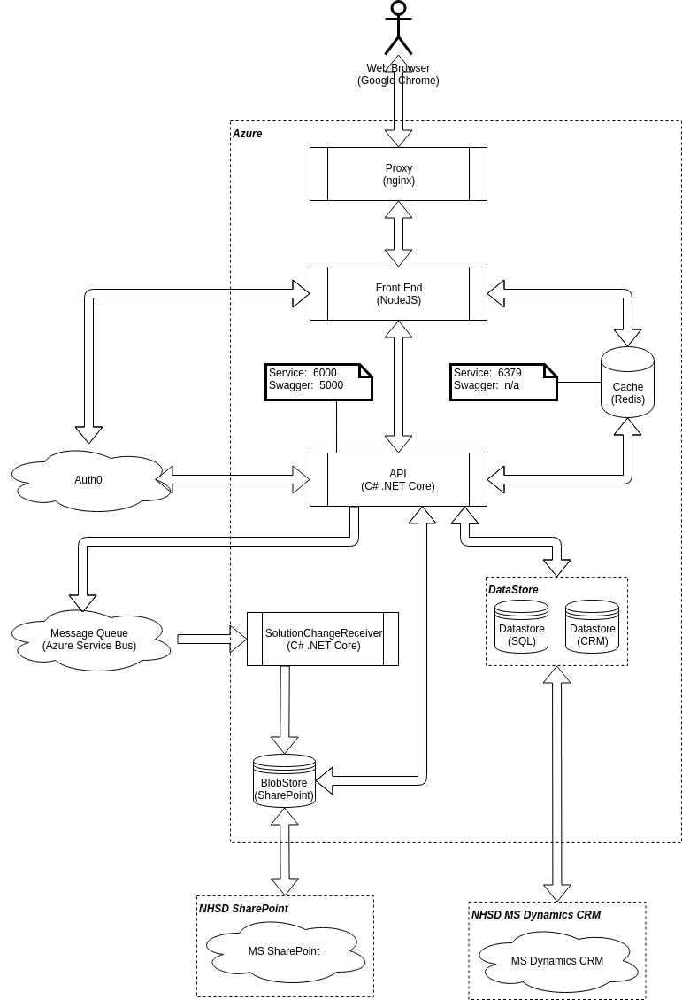

# NHS Buying Catalog System Overview (Private Beta)



## NHSD.GPITF.BuyingCatalog API
* RESTful APIs for data
* Swagger UI for testing
* pluggable datastores (SQL database or MS Dynamics CRM)
* pluggable blobstore for binary data (MS SharePoint or MongoDB)
* pluggable OAuth provider (currently Auth0)

* Swagger UI : https://localhost:5000/swagger/index.html

## Prerequisites
* .NET Core 2.1
* Optional:
  * Docker
  * Microsoft SQL Server

## Getting Started

```bash
  git clone https://github.com/TrevorDArcyEvans/NHSBuyingCatalogue.git
  cd NHSBuyingCatalogue/beta-private/api/NHSD.GPITF.BuyingCatalog
  dotnet build
  dotnet test
```

## Settings
* Various settings are output to the console log on startup
 * Settings are obtained from:
   * appsettings.json
   * hosting.json
   * autofac.json
   * nLog.config
   * _user secrets file_
   * environment variables

<details>

 | Setting                                           | Description
 |:--------------------------------------------------|--------------------------------------
 | Log:ConnectionString                              | .NET connection string to a database to send logs
 | urls                                              | URL to host Swagger UI for testing
 | RepositoryDatabase:Connection                     | Which database connection to use eg _SqLite_
 | RepositoryDatabase:SqLite:Type                    | Type of database to which we are connecting eg _PostgreSql_ <p>Valid values:<ul><li>SqlServer</li><li>SqLite</li><li>MySql</li><li>PostgreSql</li></ul>
 | RepositoryDatabase:SqLite:ConnectionString        | .NET connection string to database to store results <p> eg:  ```Data Source=|DataDirectory|Data/BuyingCatalog.sqlite3;```
 

```csharp
    private void DumpSettings()
    {
      Console.WriteLine("Settings:");
      Console.WriteLine($"  CRM:");
      Console.WriteLine($"    CRM_CLIENTID                      : {Settings.CRM_CLIENTID(Configuration)}");
      Console.WriteLine($"    CRM_CLIENTSECRET                  : {Settings.CRM_CLIENTSECRET(Configuration)}");
      Console.WriteLine($"    CRM_CACHE_EXPIRY_MINS             : {Settings.CRM_CACHE_EXPIRY_MINS(Configuration)}");
      Console.WriteLine($"    CRM_SHORT_TERM_CACHE_EXPIRY_SECS  : {Settings.CRM_SHORT_TERM_CACHE_EXPIRY_SECS(Configuration)}");

      Console.WriteLine($"  GIF:");
      Console.WriteLine($"    GIF_CRM_URL                 : {Settings.GIF_CRM_URL(Configuration)}");
      Console.WriteLine($"    GIF_AUTHORITY_URI           : {Settings.GIF_AUTHORITY_URI(Configuration)}");
      Console.WriteLine($"    GIF_AZURE_CLIENT_ID         : {Settings.GIF_AZURE_CLIENT_ID(Configuration)}");
      Console.WriteLine($"    GIF_ENCRYPTED_CLIENT_SECRET : {Settings.GIF_ENCRYPTED_CLIENT_SECRET(Configuration)}");

      Console.WriteLine($"  USE_CRM:");
      Console.WriteLine($"    USE_CRM : {Settings.USE_CRM(Configuration)}");

      Console.WriteLine($"  DATASTORE:");
      Console.WriteLine($"    DATASTORE_CONNECTION        : {Settings.DATASTORE_CONNECTION(Configuration)}");
      Console.WriteLine($"    DATASTORE_CONNECTIONTYPE    : {Settings.DATASTORE_CONNECTIONTYPE(Configuration, Settings.DATASTORE_CONNECTION(Configuration))}");
      Console.WriteLine($"    DATASTORE_CONNECTIONSTRING  : {Settings.DATASTORE_CONNECTIONSTRING(Configuration, Settings.DATASTORE_CONNECTION(Configuration))}");

      Console.WriteLine($"  LOG:");
      Console.WriteLine($"    LOG_CONNECTIONSTRING : {Settings.LOG_CONNECTIONSTRING(Configuration)}");
      Console.WriteLine($"    LOG_CRM              : {Settings.LOG_CRM(Configuration)}");
      Console.WriteLine($"    LOG_SHAREPOINT       : {Settings.LOG_SHAREPOINT(Configuration)}");
      Console.WriteLine($"    LOG_BEARERAUTH       : {Settings.LOG_BEARERAUTH(Configuration)}");

      Console.WriteLine($"  OIDC:");
      Console.WriteLine($"    OIDC_USERINFO_URL : {Settings.OIDC_USERINFO_URL(Configuration)}");
      Console.WriteLine($"    OIDC_ISSUER_URL   : {Settings.OIDC_ISSUER_URL(Configuration)}");
      Console.WriteLine($"    OIDC_AUDIENCE     : {Settings.OIDC_AUDIENCE(Configuration)}");

      Console.WriteLine($"  SHAREPOINT:");
      Console.WriteLine($"    SHAREPOINT_BASEURL                  : {Settings.SHAREPOINT_BASEURL(Configuration)}");
      Console.WriteLine($"    SHAREPOINT_ORGANISATIONSRELATIVEURL : {Settings.SHAREPOINT_ORGANISATIONSRELATIVEURL(Configuration)}");
      Console.WriteLine($"    SHAREPOINT_CLIENT_ID                : {Settings.SHAREPOINT_CLIENT_ID(Configuration)}");
      Console.WriteLine($"    SHAREPOINT_CLIENT_SECRET            : {Settings.SHAREPOINT_CLIENT_SECRET(Configuration)}");
      Console.WriteLine($"    SHAREPOINT_PROVIDER_FAKE            : {Settings.SHAREPOINT_PROVIDER_FAKE(Configuration)}");
      Console.WriteLine($"    SHAREPOINT_FILE_DOWNLOAD_SERVER_URL : {Settings.SHAREPOINT_FILE_DOWNLOAD_SERVER_URL(Configuration)}");

      Console.WriteLine($"  CACHE:");
      Console.WriteLine($"    CACHE_HOST : {Settings.CACHE_HOST(Configuration)}");
    }
```

```csharp
  public static class Settings
  {
    public static string CRM_CLIENTID(IConfiguration config) => Environment.GetEnvironmentVariable("CRM_CLIENTID") ?? config["CRM:ClientId"];
    public static string CRM_CLIENTSECRET(IConfiguration config) => Environment.GetEnvironmentVariable("CRM_CLIENTSECRET") ?? config["CRM:ClientSecret"];
    public static uint CRM_CACHE_EXPIRY_MINS(IConfiguration config) => uint.Parse(Environment.GetEnvironmentVariable("CRM_CACHE_EXPIRY_MINS") ?? config["CRM:CacheExpiryMins"] ?? (7*24*60).ToString(CultureInfo.InvariantCulture));
    public static uint CRM_SHORT_TERM_CACHE_EXPIRY_SECS(IConfiguration config) => uint.Parse(Environment.GetEnvironmentVariable("CRM_SHORT_TERM_CACHE_EXPIRY_SECS") ?? config["CRM:ShortTermCacheExpirySecs"] ?? (10).ToString(CultureInfo.InvariantCulture));

    public static string GIF_CRM_URL(IConfiguration config) => Environment.GetEnvironmentVariable("GIF_CRM_URL") ?? config["CrmUrl"];
    public static string GIF_CRM_AUTHORITY(IConfiguration config) => Environment.GetEnvironmentVariable("GIF_CRM_AUTHORITY") ?? config["CrmAuthority"];
    public static string GIF_AUTHORITY_URI(IConfiguration config) => Environment.GetEnvironmentVariable("GIF_AUTHORITY_URI") ?? config["GIF:Authority_Uri"] ?? "http://localhost:5001";
    public static string GIF_AZURE_CLIENT_ID(IConfiguration config) => Environment.GetEnvironmentVariable("GIF_AZURE_CLIENT_ID") ?? config["AzureClientId"];
    public static string GIF_ENCRYPTED_CLIENT_SECRET(IConfiguration config) => Environment.GetEnvironmentVariable("GIF_ENCRYPTED_CLIENT_SECRET") ?? config["EncryptedClientSecret"];

    public static string DATASTORE_CONNECTION(IConfiguration config) => Environment.GetEnvironmentVariable("DATASTORE_CONNECTION") ?? config["RepositoryDatabase:Connection"];
    public static string DATASTORE_CONNECTIONTYPE(IConfiguration config, string connection) => Environment.GetEnvironmentVariable("DATASTORE_CONNECTIONTYPE") ?? config[$"RepositoryDatabase:{connection}:Type"];
    public static string DATASTORE_CONNECTIONSTRING(IConfiguration config, string connection) => (Environment.GetEnvironmentVariable("DATASTORE_CONNECTIONSTRING") ?? config[$"RepositoryDatabase:{connection}:ConnectionString"]);

    public static string OIDC_ISSUER_URL(IConfiguration config) => Environment.GetEnvironmentVariable("OIDC_ISSUER_URL") ?? config["Jwt:Authority"];
    public static string OIDC_AUDIENCE(IConfiguration config) => Environment.GetEnvironmentVariable("OIDC_AUDIENCE") ?? config["Jwt:Audience"];
    public static string OIDC_USERINFO_URL(IConfiguration config) => Environment.GetEnvironmentVariable("OIDC_USERINFO_URL") ?? config["Jwt:UserInfo"];

    public static bool USE_CRM(IConfiguration config) => bool.Parse(Environment.GetEnvironmentVariable("USE_CRM") ?? config["UseCRM"] ?? false.ToString());

    public static string LOG_CONNECTIONSTRING(IConfiguration config) => Environment.GetEnvironmentVariable("LOG_CONNECTIONSTRING") ?? config["Log:ConnectionString"];
    public static bool LOG_CRM(IConfiguration config) => bool.Parse(Environment.GetEnvironmentVariable("LOG_CRM") ?? config["Log:CRM"] ?? false.ToString());
    public static bool LOG_SHAREPOINT(IConfiguration config) => bool.Parse(Environment.GetEnvironmentVariable("LOG_SHAREPOINT") ?? config["Log:SharePoint"] ?? false.ToString());
    public static bool LOG_BEARERAUTH(IConfiguration config) => bool.Parse(Environment.GetEnvironmentVariable("LOG_BEARERAUTH") ?? config["Log:BearerAuth"] ?? false.ToString());

    public static string SHAREPOINT_BASEURL(IConfiguration config) => Environment.GetEnvironmentVariable("SHAREPOINT_BASEURL") ?? config["SharePoint:BaseUrl"];
    public static string SHAREPOINT_ORGANISATIONSRELATIVEURL(IConfiguration config) => Environment.GetEnvironmentVariable("SHAREPOINT_ORGANISATIONSRELATIVEURL") ?? config["SharePoint:OrganisationsRelativeUrl"];
    public static string SHAREPOINT_CLIENT_ID(IConfiguration config) => Environment.GetEnvironmentVariable("SHAREPOINT_CLIENT_ID") ?? config["SharePoint:ClientId"];
    public static string SHAREPOINT_CLIENT_SECRET(IConfiguration config) => Environment.GetEnvironmentVariable("SHAREPOINT_CLIENT_SECRET") ?? config["SharePoint:ClientSecret"];
    public static string SHAREPOINT_PROVIDER_ENV(IConfiguration config) => Environment.GetEnvironmentVariable("SHAREPOINT_PROVIDER_ENV");
    public static bool SHAREPOINT_PROVIDER_FAKE(IConfiguration config) => SHAREPOINT_PROVIDER_ENV(config) == "test";
    public static string SHAREPOINT_FILE_DOWNLOAD_SERVER_URL(IConfiguration config) => Environment.GetEnvironmentVariable("SHAREPOINT_FILE_DOWNLOAD_SERVER_URL") ?? config["SharePoint:FileDownloadServerUrl"] ?? "http://localhost:9000/";

    public static string CACHE_HOST(IConfiguration config) => Environment.GetEnvironmentVariable("CACHE_HOST") ?? config["Cache:Host"] ?? "localhost";

    public static bool USE_AMQP(IConfiguration config) => bool.Parse(Environment.GetEnvironmentVariable("USE_AMQP") ?? config["AMQP:UseAMQP"] ?? false.ToString());
    public static bool USE_AZURE_SERVICE_BUS(IConfiguration config) => bool.Parse(Environment.GetEnvironmentVariable("USE_AZURE_SERVICE_BUS") ?? config["AMQP:UseAzureServiceBus"] ?? false.ToString());
    public static string AMQP_PROTOCOL(IConfiguration config) => Environment.GetEnvironmentVariable("AMQP_PROTOCOL") ?? config["AMQP:Protocol"] ?? "amqp";
    public static string AMQP_POLICY_NAME(IConfiguration config) => Environment.GetEnvironmentVariable("AMQP_POLICY_NAME") ?? config["AMQP:PolicyName"] ?? "admin";
    public static string AMQP_POLICY_KEY(IConfiguration config) => Environment.GetEnvironmentVariable("AMQP_POLICY_KEY") ?? config["AMQP:PolicyKey"] ?? "admin";
    public static string AMQP_NAMESPACE_URL(IConfiguration config) => Environment.GetEnvironmentVariable("AMQP_NAMESPACE_URL") ?? config["AMQP:NamespaceUrl"] ?? "localhost:5672";
    public static string AMQP_TOPIC_PREFIX(IConfiguration config) => Environment.GetEnvironmentVariable("AMQP_TOPIC_PREFIX") ?? config["AMQP:TopicPrefix"] ?? "topic://";
    public static uint AMQP_TTL_MINS(IConfiguration config) => uint.Parse(Environment.GetEnvironmentVariable("AMQP_TTL_MINS") ?? config["AMQP:TtlMins"] ?? (7*24*60).ToString(CultureInfo.InvariantCulture));
  }
```

 ```json
{
  "urls": "http://*:5100",

  "wwwroot": "wwwroot",

  "UseCRM": false,

  "GIF":
  {
    "Authority_Uri": "http://crm:5001"
  },

  "Log":
  {
    "CRM": true,
    "SharePoint": true,
    "BearerAuth": true
  },

  "Cache":
  {
    "Host": "localhost"
  },

  "Datastore":
  {
    "Connection": "SqLite",

    "SqLite":
    {
      "Type": "SqLite",
      "ConnectionString": "Data Source=|DataDirectory|Data/BuyingCatalog.sqlite3;"
    },

    "SqlServer":
    {
      "Type": "SqlServer",
      "ConnectionString": "Data Source=localhost;Initial Catalog=BuyingCatalog;Integrated Security=True;MultipleActiveResultSets=True"
    },

    "MySql":
    {
      "Type": "MySql",
      "ConnectionString": "server=127.0.0.1;uid=NHSD;pwd=DisruptTheMarket;database=BuyingCatalog;SslMode=none"
    }
  },

  "Jwt":
  {
    "Authority": "https://buying-catalogue-beta-prototype.eu.auth0.com/",
    "Audience": "api.buying-catalogue-beta-prototype",
    "UserInfo": "https://buying-catalogue-beta-prototype.eu.auth0.com/userinfo",
  },

  "Logging":
  {
    "PathFormat": "Logs/NHSD-GPITF-BuyingCatalog-{Date}.txt",
    "IncludeScopes": false,
    "Debug":
    {
      "LogLevel":
      {
        "Default": "Warning"
      }
    },
    "Console":
    {
      "LogLevel":
      {
        "Default": "Warning"
      }
    }
  }
}
```

</details>

### Environment Variables
https://docs.microsoft.com/en-gb/aspnet/core/fundamentals/configuration/index?tabs=basicconfiguration&view=aspnetcore-3.0#conventions

<details>

#### Keys
Configuration keys adopt the following conventions:
  * Keys are case-insensitive. For example, ConnectionString and connectionstring are treated as equivalent keys.
  * If a value for the same key is set by the same or different configuration providers, the last value set on the key is the value used.
  * Hierarchical keys
    * Within the Configuration API, a colon separator (:) works on all platforms.
    * **In environment variables, a colon separator may not work on all platforms. A double underscore (__) is supported by all platforms and is automatically converted into a colon.**
    * In Azure Key Vault, hierarchical keys use -- (two dashes) as a separator. You must provide code to replace the dashes with a colon when the secrets are loaded into the app's configuration.
  * The ConfigurationBinder supports binding arrays to objects using array indices in configuration keys. Array binding is described in the Bind an array to a class section.

#### Values
Configuration values adopt the following conventions:
  * Values are strings.
  * Null values can't be stored in configuration or bound to objects.

</details>

## Logging
Logging is provided by `nLog` its settings are in `nLog.config`

<details>

Typical SQL script to create a log table would be:
```sql
-- MS SQL Server
CREATE TABLE Log 
(
  Timestamp DATETIME2,
  Loglevel TEXT,
  Callsite TEXT,
  Message TEXT
);
CREATE INDEX IDX_Timestamp ON Log(Timestamp);

-- MySQL aka MariaDB
CREATE TABLE Log 
(
  Timestamp DATETIME,
  Loglevel TEXT,
  Callsite TEXT,
  Message TEXT
);
CREATE INDEX IDX_Timestamp ON Log(Timestamp);

-- PostgreSQL
CREATE TABLE Log 
(
  "Timestamp" TIMESTAMP,
  "Loglevel" TEXT,
  "Callsite" TEXT,
  "Message" TEXT
);
CREATE INDEX IDX_Timestamp ON Log("Timestamp");

-- SQLite
CREATE TABLE Log 
(
  Timestamp TEXT,
  Loglevel TEXT,
  Callsite TEXT,
  Message TEXT
);
CREATE INDEX IDX_Timestamp ON Log(Timestamp);
```

</details>
